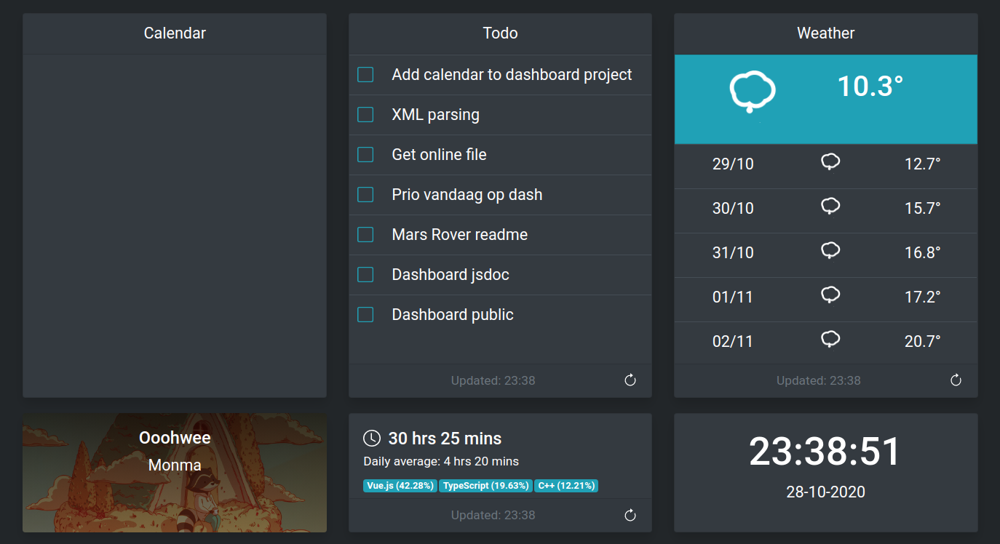

# Dashboard
A work in progress Dashboard for my Raspberry Pi.

<p align="center">
  
</p>

## Widgets
- Google Calendar (In progress)
- Todoist task list
- Weather forecast using Dark Sky
- Spotify now playing indicator (Playback controls to be added)
- WakaTime code statistics
- Time & Date

## Setup

1. Run `yarn` to install dependencies.
2. Run `yarn electron:serve` to start the development server.

## Configuration
A environment variable files is used for a some user-specif (and sensitive) information. Create a `.env` file in the root folder and specify the following properties:

```env
VUE_APP_SPOTIFY_API_AUTH_URL="https://accounts.spotify.com/authorize?"
VUE_APP_SPOTIFY_API_BASE_URL="https://api.spotify.com/v1/"
VUE_APP_SPOTIFY_API_REDIRECT_URL="http://localhost:8080"
VUE_APP_SPOTIFY_API_CLIENT_ID="<YOUR SPOTIFY CLIENT ID>"
VUE_APP_SPOTIFY_API_SCOPES="user-read-currently-playing,user-read-playback-state"

VUE_APP_TODOIST_API_BASE_URL="https://api.todoist.com/rest/v1"
VUE_APP_TODOIST_API_USER_TOKEN="<YOUR TODOIST USER TOKEN>"

VUE_APP_PROXY_API_URL="<YOUR PROXY>"

VUE_APP_WAKATIME_API_BASE_URL="https://wakatime.com/api/v1/"
VUE_APP_WAKATIME_API_USER_TOKEN="<YOUR WAKATIME USER TOKEN>"
VUE_APP_WAKATIME_API_USER_USERNAME="<YOUR WAKATIME USERNAME>"

VUE_APP_DARKSKY_API_BASE_URL="https://api.darksky.net/forecast/<YOUR DARKSKY USER TOKEN>/<YOUR LOCATION>?units=si"
```